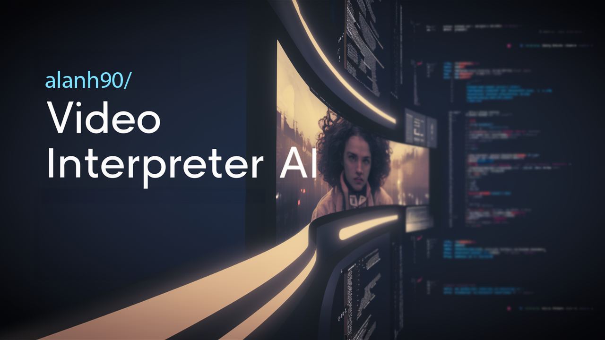

# Video Understanding App



This Streamlit-based application integrates computer vision and AI to analyze and understand video content. It uses OpenAI's powerful GPT-4 API to generate descriptive text for video sequences, offering a glimpse into the content and context of the videos.

## Features

- **Video Upload**: Users can upload videos in MP4, AVI, or MOV formats.
- **Frame Display**: The application displays the first frame of the uploaded video.
- **Automated Description**: Leverages OpenAI's GPT-4 to generate descriptions for the video content.

## How to Use

1. Upload a video file using the Streamlit file uploader.
2. Wait as the app processes the video and displays the first frame.
3. Read the generated description of the video content.

## Technical Details

- The app saves the video to a temporary file for processing.
- Frames are extracted and converted to base64 for analysis.
- Descriptions are generated by sending frames to the OpenAI API.
- The first frame of the video and its description are displayed on the UI.

## Getting Started

To run this application locally, follow these steps:

1. Ensure you have Python installed on your system.
2. Clone this repository to your local machine.
3. Install the required dependencies
4. Create a `.env` file in the root directory of the project and add your OpenAI API key:

    ```plaintext
    OPENAI_API_KEY='your_api_key_here'
    ```

5. Start the Streamlit app:

    ```shell
    streamlit run your_script_name.py
    ```

Replace `your_script_name.py` with the name of your Python script.

## Installation

Make sure you have the following Python packages installed:

- streamlit
- opencv-python-headless
- base64
- tempfile
- openai
- dotenv
- requests

You can install these packages using `pip`
